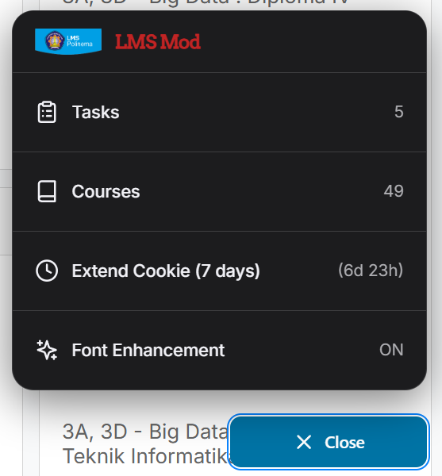
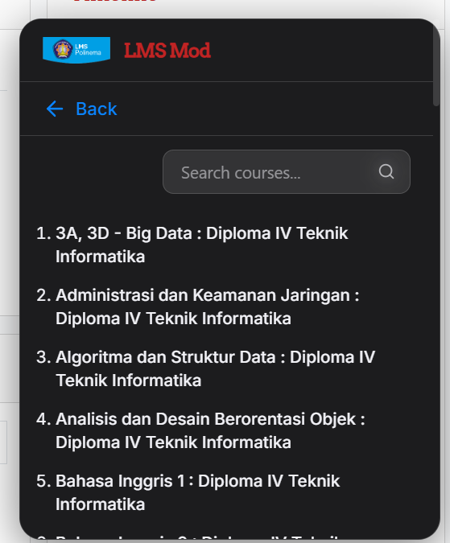
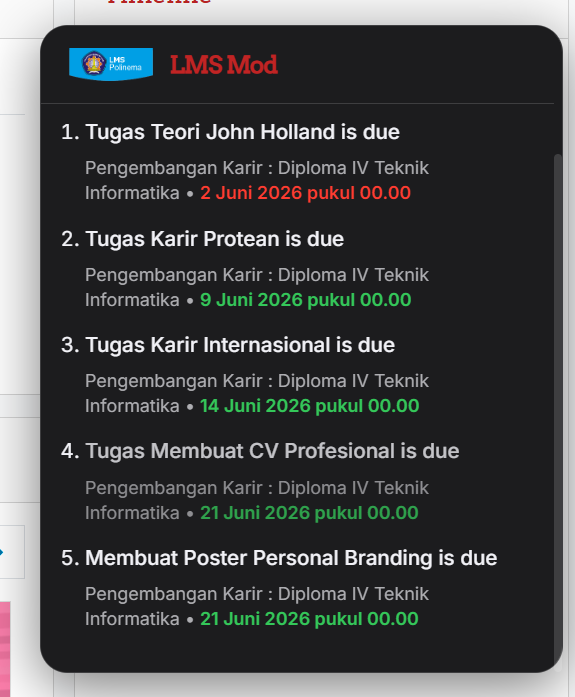
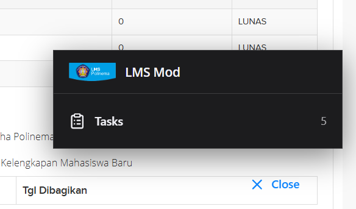

# Polinema LMS & SIAKAD Mod

A userscript extension for Polinema LMS (lmsslc.polinema.ac.id) and Siakad, providing task and course data fetching, font enhancements, and a custom UI menu injected into the pages.

## Installation

To use this extension, you must have the [Tampermonkey](https://www.tampermonkey.net/) extension installed in your browser. Once installed, simply click the button below to install the script:

## Previews

### LMS Interface

### SIAKAD Interface

